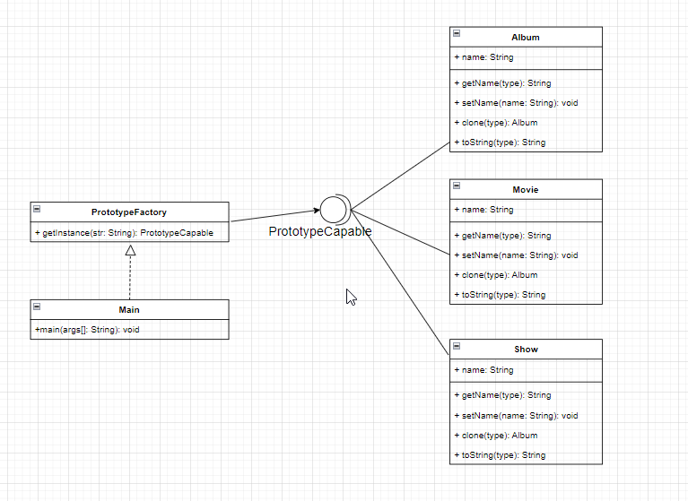
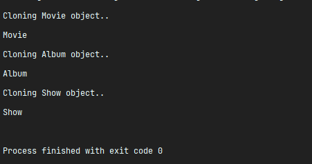

**Реализация шаблона проектирования Prototype на примере приложения, для которого очень часто требуются экземпляры классов Movie, Album и Show.**

В приложении добавляются Фильмы, Альбомы и Шоу котоыре которые имеют одинаковое состояние.

Цель задания:  **Не  создавать каждый раз их экземпляры для добавления в базу данных (представим что онау нас есть), так как это дорого.**

Должны быть реализованы классы:

Album Movie Show c полем: _name_, 

Остальная реализация сугубо индивидуальная

UML диаграма 

